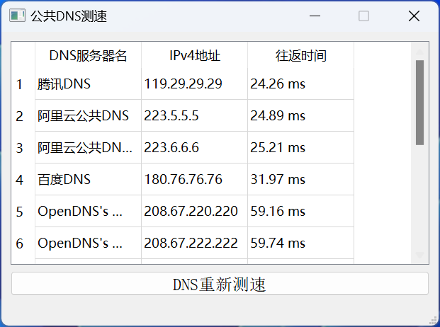
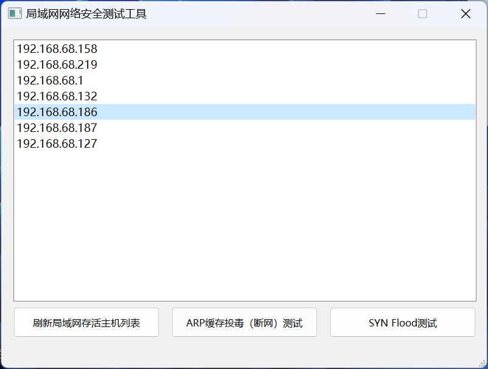
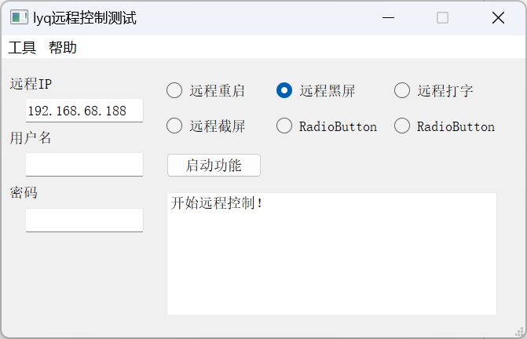

## lyqNetTools
---------
项目的目标是制作与计算机网络有关的一系列实验小软件。
目前已经实现的有：
- **pingtest4_with_ui.py**  ---- “公共DNS测速"，对常见的公共DNS服务器进行测速和比较的工具。例如，阿里DNS, 腾讯DNS，谷歌DNS等。

- **lan_manager_test1.py**  ---- "局域网管理者"，搜索本地局域网里的存活主机，并对指定主机进行ARP缓存欺骗，对指定主机进行SYN Flood测试。

- **remote_control_pyqt_test1.py** ---- "局域网远程控制"，基于TCP实现的一些简单远程控制功能

